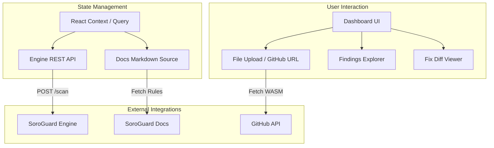

# SoroGuard App: The Security Command Center for Soroban


[](https://www.drips.network/wave)
[](https://reactjs.org/)
[](https://tailwindcss.com/)

**The visual gateway to SoroGuard. A high-performance React dashboard for uploading contracts, visualizing vulnerabilities, and managing remediation workflows.**

---

# 🎨 Overview

`soroguard-app` is the high-fidelity user interface that transforms complex static analysis data from the `soroguard-engine` into actionable security intelligence. Designed for both protocol developers and security auditors, the app provides a seamless workflow for identifying and fixing vulnerabilities before they reach the Stellar network.

### Key Capabilities:
*   **WASM Visualization:** Interactive deconstruction of contract exports and detected flaws.
*   **Remediation Workflow:** Direct links to rule-based fix guides and inline "suggested patch" diffs.
*   **Ecosystem Integration:** Fetch contracts directly from GitHub repositories or upload local binaries.
*   **Audit-Ready Reporting:** Generate shareable scan permalinks and PDF summaries for institutional verification.

---

# 🏗️ Application Architecture

The app is built as a modern, client-side React application that orchestrates data from the SoroGuard Engine and Documentation hub.



---

# ✨ Core Features

| Feature | Technical Implementation | Ecosystem Value |
| :--- | :--- | :--- |
| **Intelligent Scanner** | Drag-and-drop `.wasm` upload or GitHub release integration via specialized hooks. | Lowers the barrier to entry for rapid security iterations. |
| **Severity Grouping** | Collapsible sections with **CRITICAL / HIGH / MEDIUM** severity categorization. | Allows teams to prioritize remediation of high-impact treasury threats. |
| **Inline Fix Diff** | A custom React-based diff viewer showing before/after code snippets for auto-fixable rules. | Accelerates the fix-cycle for common patterns like integer safety. |
| **Scan Permalinks** | Stateless URL generation for sharing scan results with audit teams or stakeholders. | Facilitates trustless verification of security status between protocol teams. |

---

# 📂 Repository Structure

```text
soroguard-app/
├── src/
│   ├── components/     # UI components (DiffViewer, Sidebar, Charts)
│   ├── hooks/          # API hooks for Engine and Docs interaction
│   ├── pages/          # Main dashboard and results views
│   ├── services/       # API abstraction layer
│   └── styles/         # Tailwind CSS themes and glassmorphism tokens
├── public/             # Static assets and badges
├── package.json        # Dependencies and scripts
└── README.md           # You are here
```

---

# 🛠️ Development & Contributing

We are building a premium developer tool and welcome contributions from the React community.

### Local Setup
1. **Clone the Repo:** `git clone https://github.com/soroguard/soroguard-app.git`
2. **Install:** `npm install`
3. **Set Env:** Create a `.env` with `VITE_ENGINE_API_URL=http://localhost:3000`
4. **Dev:** `npm run dev`

### Contributor Path (Wave 5)
*   **Frontend Developers:** Help us build the "Fix Diff" visualization component.
*   **UX Designers:** Improve the responsive layout for mobile security monitoring.
*   **Accessibility Experts:** Help us reach WCAG AA standards across all dashboard components.

---

# 📄 License

This project is licensed under the **Apache License 2.0**.
